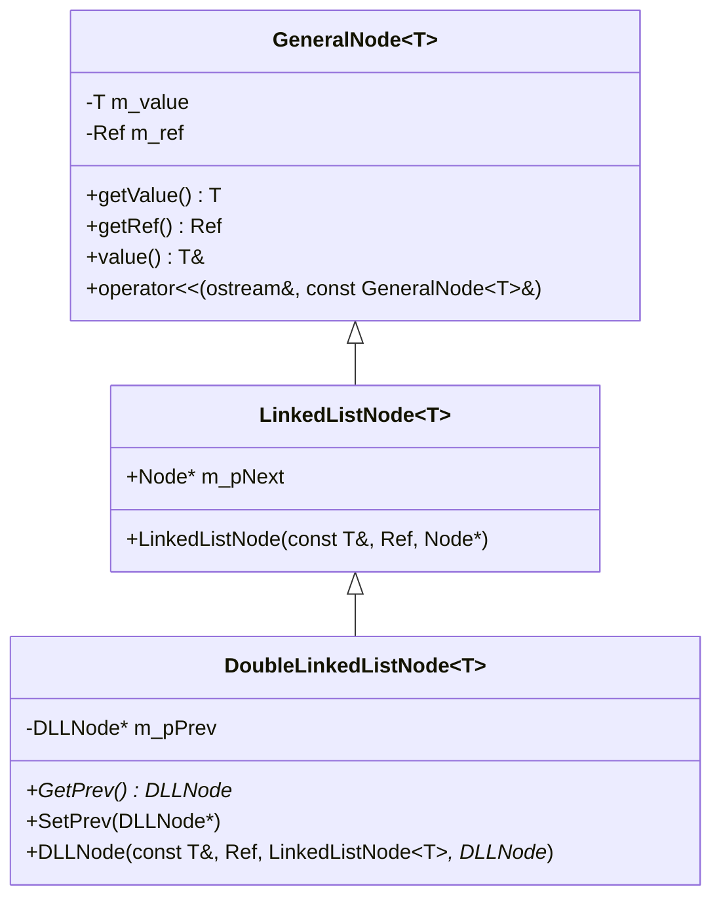
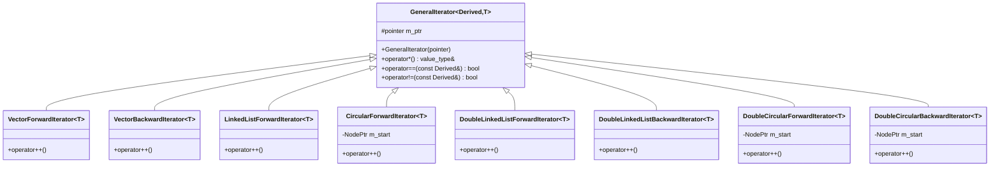
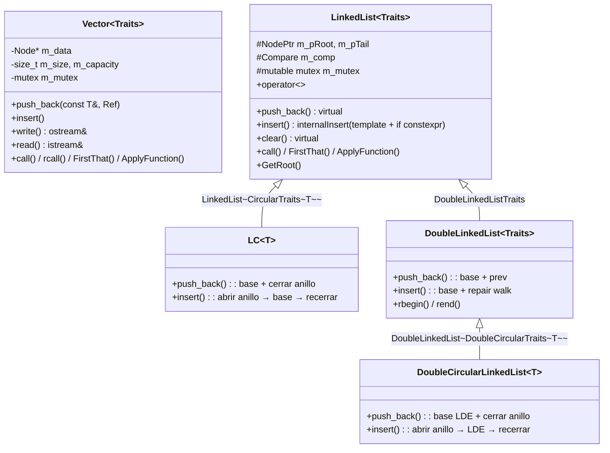
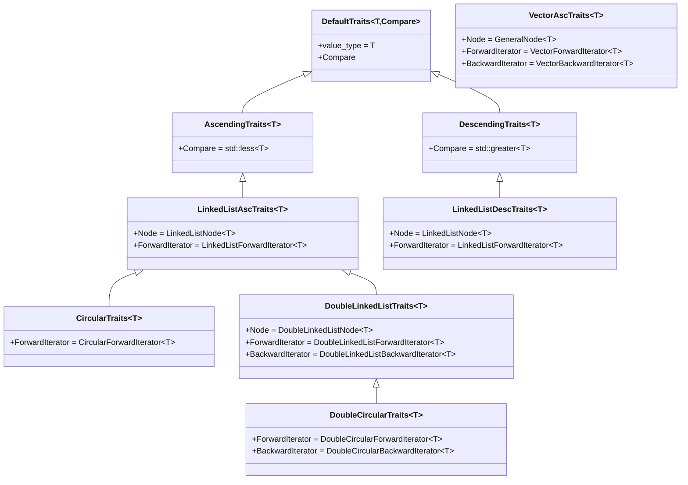
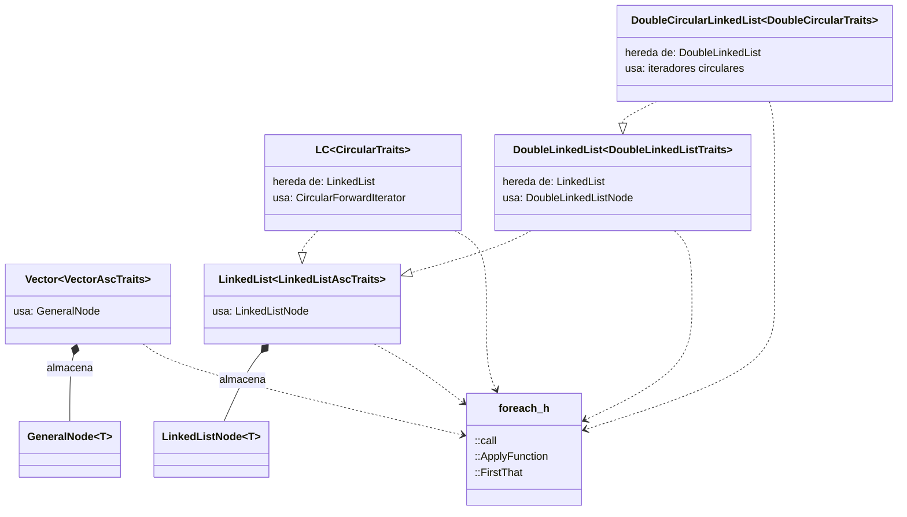

# Jerarquías de clases del curso

## 1 · Nodos

```mermaid
classDiagram
    class GeneralNode~T~ {
        -T m_value
        -Ref m_ref
        +getValue() T
        +getRef() Ref
        +value() T&
        +operator<<(ostream&, const GeneralNode~T~&)
    }
    class LinkedListNode~T~ {
        +Node* m_pNext
        +LinkedListNode(const T&, Ref, Node*)
    }
    class DoubleLinkedListNode~T~ {
        -DLLNode* m_pPrev
        +GetPrev() DLLNode*
        +SetPrev(DLLNode*)
        +DLLNode(const T&, Ref, LinkedListNode~T~*, DLLNode*)
    }
    GeneralNode~T~ <|-- LinkedListNode~T~
    LinkedListNode~T~ <|-- DoubleLinkedListNode~T~
```

## 2 · Iteradores (CRTP)

```mermaid
classDiagram
    class GeneralIterator~Derived,T~ {
        #pointer m_ptr
        +GeneralIterator(pointer)
        +operator*() value_type&
        +operator==(const Derived&) bool
        +operator!=(const Derived&) bool
    }
    class VectorForwardIterator~T~ {
        +operator++()
    }
    class VectorBackwardIterator~T~ {
        +operator++()
    }
    class LinkedListForwardIterator~T~ {
        +operator++()
    }
    class CircularForwardIterator~T~ {
        -NodePtr m_start
        +operator++()
    }
    class DoubleLinkedListForwardIterator~T~ {
        +operator++()
    }
    class DoubleLinkedListBackwardIterator~T~ {
        +operator++()
    }
    class DoubleCircularForwardIterator~T~ {
        -NodePtr m_start
        +operator++()
    }
    class DoubleCircularBackwardIterator~T~ {
        -NodePtr m_start
        +operator++()
    }
    GeneralIterator~Derived,T~ <|-- VectorForwardIterator~T~
    GeneralIterator~Derived,T~ <|-- VectorBackwardIterator~T~
    GeneralIterator~Derived,T~ <|-- LinkedListForwardIterator~T~
    GeneralIterator~Derived,T~ <|-- CircularForwardIterator~T~
    GeneralIterator~Derived,T~ <|-- DoubleLinkedListForwardIterator~T~
    GeneralIterator~Derived,T~ <|-- DoubleLinkedListBackwardIterator~T~
    GeneralIterator~Derived,T~ <|-- DoubleCircularForwardIterator~T~
    GeneralIterator~Derived,T~ <|-- DoubleCircularBackwardIterator~T~
```

## 3 · Contenedores

```mermaid
classDiagram
    class Vector~Traits~ {
        -Node* m_data
        -size_t m_size, m_capacity
        -mutex m_mutex
        +push_back(const T&, Ref)
        +insert()
        +write() ostream&
        +read() istream&
        +call() / rcall() / FirstThat() / ApplyFunction()
    }
    class LinkedList~Traits~ {
        #NodePtr m_pRoot, m_pTail
        #Compare m_comp
        #mutable mutex m_mutex
        +push_back() virtual
        +insert() : internalInsert (template + if constexpr)
        +clear() virtual
        +operator<</operator>>
        +call() / FirstThat() / ApplyFunction()
        +GetRoot()
    }
    class LC~T~ {
        +push_back() : base + cerrar anillo
        +insert() : abrir anillo → base → recerrar
    }
    class DoubleLinkedList~Traits~ {
        +push_back() : base + prev
        +insert() : base + repair walk
        +rbegin() / rend()
    }
    class DoubleCircularLinkedList~T~ {
        +push_back() : base LDE + cerrar anillo
        +insert() : abrir anillo → LDE → recerrar
    }
    LinkedList~Traits~ <|-- LC~T~ : LinkedList~CircularTraits~T~~
    LinkedList~Traits~ <|-- DoubleLinkedList~Traits~ : DoubleLinkedListTraits
    DoubleLinkedList~Traits~ <|-- DoubleCircularLinkedList~T~ : DoubleLinkedList~DoubleCircularTraits~T~~
```

## 4 · Traits

```mermaid
classDiagram
    class DefaultTraits~T,Compare~ {
        +value_type = T
        +Compare
    }
    class AscendingTraits~T~ {
        +Compare = std::less~T~
    }
    class DescendingTraits~T~ {
        +Compare = std::greater~T~
    }
    class LinkedListAscTraits~T~ {
        +Node = LinkedListNode~T~
        +ForwardIterator = LinkedListForwardIterator~T~
    }
    class LinkedListDescTraits~T~ {
        +Node = LinkedListNode~T~
        +ForwardIterator = LinkedListForwardIterator~T~
    }
    class CircularTraits~T~ {
        +ForwardIterator = CircularForwardIterator~T~
    }
    class DoubleLinkedListTraits~T~ {
        +Node = DoubleLinkedListNode~T~
        +ForwardIterator = DoubleLinkedListForwardIterator~T~
        +BackwardIterator = DoubleLinkedListBackwardIterator~T~
    }
    class DoubleCircularTraits~T~ {
        +ForwardIterator = DoubleCircularForwardIterator~T~
        +BackwardIterator = DoubleCircularBackwardIterator~T~
    }
    class VectorAscTraits~T~ {
        +Node = GeneralNode~T~
        +ForwardIterator = VectorForwardIterator~T~
        +BackwardIterator = VectorBackwardIterator~T~
    }
    DefaultTraits~T,Compare~ <|-- AscendingTraits~T~
    DefaultTraits~T,Compare~ <|-- DescendingTraits~T~
    AscendingTraits~T~ <|-- LinkedListAscTraits~T~
    DescendingTraits~T~ <|-- LinkedListDescTraits~T~
    LinkedListAscTraits~T~ <|-- CircularTraits~T~
    LinkedListAscTraits~T~ <|-- DoubleLinkedListTraits~T~
    DoubleLinkedListTraits~T~ <|-- DoubleCircularTraits~T~
```

## 5 · Composición

```mermaid
classDiagram
    class Vector~VectorAscTraits~ {
        usa: GeneralNode
    }
    class LinkedList~LinkedListAscTraits~ {
        usa: LinkedListNode
    }
    class LC~CircularTraits~ {
        hereda de: LinkedList
        usa: CircularForwardIterator
    }
    class DoubleLinkedList~DoubleLinkedListTraits~ {
        hereda de: LinkedList
        usa: DoubleLinkedListNode
    }
    class DoubleCircularLinkedList~DoubleCircularTraits~ {
        hereda de: DoubleLinkedList
        usa: iteradores circulares
    }
    class foreach_h {
        ::call
        ::ApplyFunction
        ::FirstThat
    }
    Vector~VectorAscTraits~ *-- GeneralNode~T~ : almacena
    LinkedList~LinkedListAscTraits~ *-- LinkedListNode~T~ : almacena
    LC~CircularTraits~ ..|> LinkedList~LinkedListAscTraits~
    DoubleLinkedList~DoubleLinkedListTraits~ ..|> LinkedList~LinkedListAscTraits~
    DoubleCircularLinkedList~DoubleCircularTraits~ ..|> DoubleLinkedList~DoubleLinkedListTraits~
    Vector~VectorAscTraits~ ..> foreach_h
    LinkedList~LinkedListAscTraits~ ..> foreach_h
    LC~CircularTraits~ ..> foreach_h
    DoubleLinkedList~DoubleLinkedListTraits~ ..> foreach_h
    DoubleCircularLinkedList~DoubleCircularTraits~ ..> foreach_h
```
